# Rate Limiting policies basedon a service level acces(SLA) in Anypoint Platform

                        Rate Limiting policies based on a service level access (SLA) are client ID-based policies that use the cliend_id as a reference to impose limits on the number of requests that each application can make within a period of time. To use these policies, you need to create at least one SLA tier to define request limits.

- Create a RAML in the Design Centre with traits  with client\_id and client\_secret  as shown below.

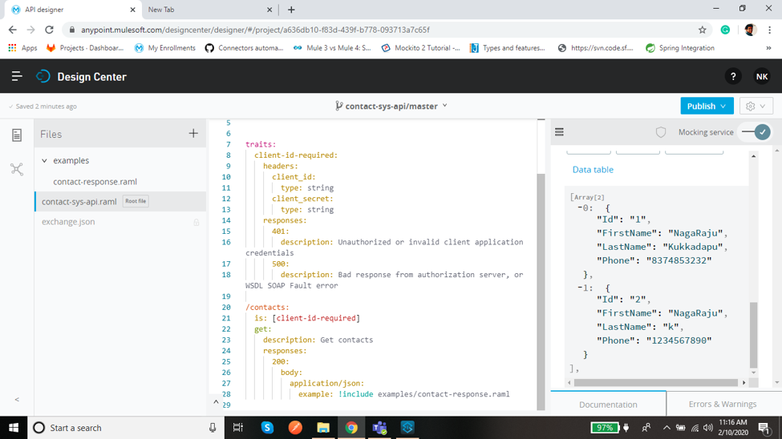

- Publish the API to Exchange.

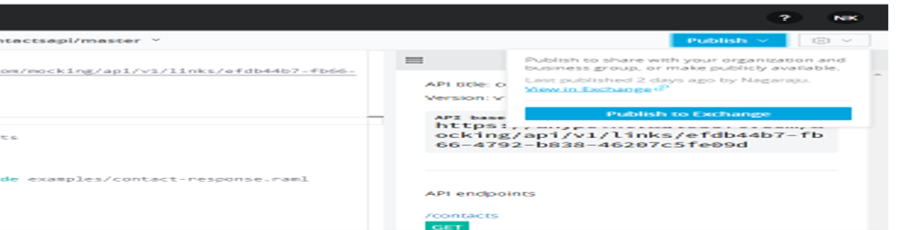

- Go to Exchange there you can see the API get published
 
 
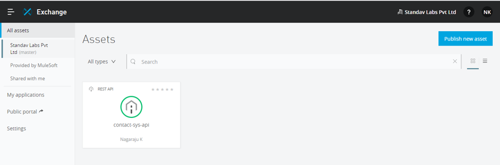

- Go to API Manager and click on Manage API Manage API From Exchange

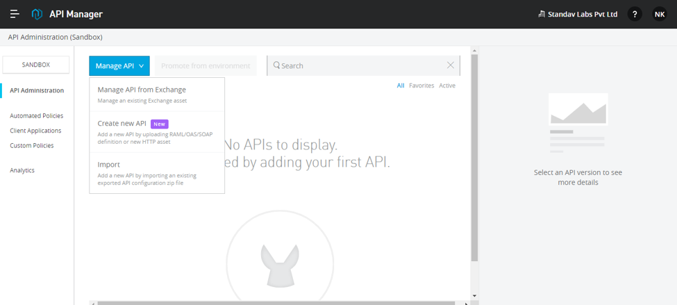

- Call the API from exchange as shown below and select the check box if it is mule 4 application and the click on Save.

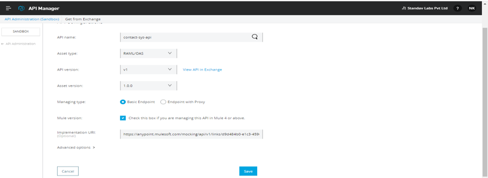

- Create a project in Anypoint Studio and deploy to cloudhub

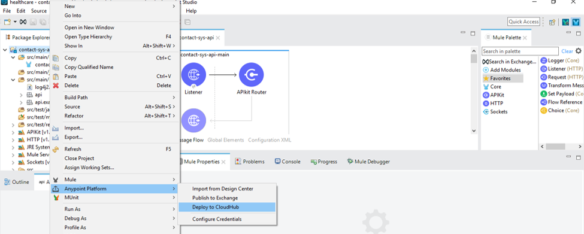

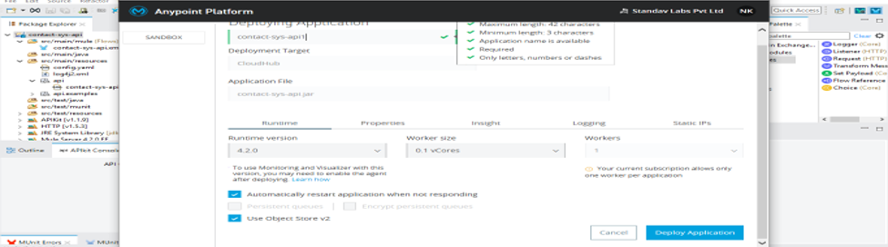

- Go you can see API in API Manager is active and now to Runtime Manager you can see API in cloud get started.

 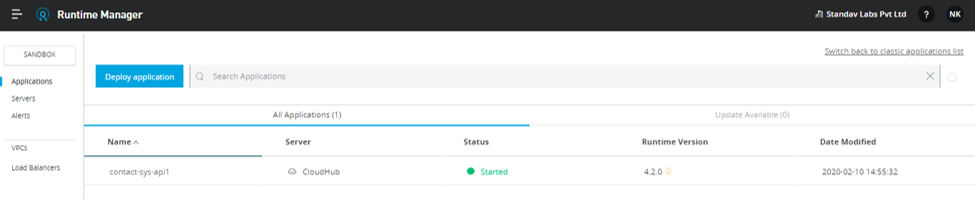

- Go to API Manager  and click on the API &rarr; SLA tier on left edge

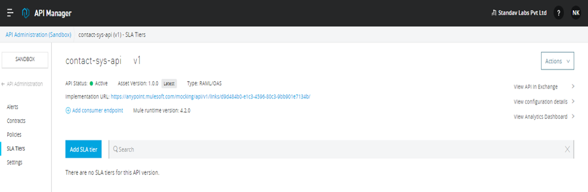

- Here am applying Rate Limiting Policies for Internal and External user

- Limits &rarr;  you can set for different Time Units.

    Internal : 5 Requests in one minute

    External: 3  Requests in one minute

- Configure the SLA Tier as below.

**INTERNAL:**

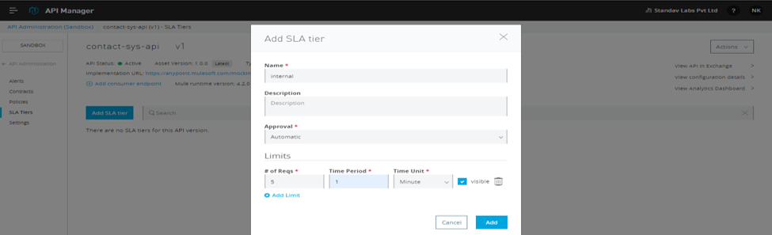

 

**EXTERNAL** :

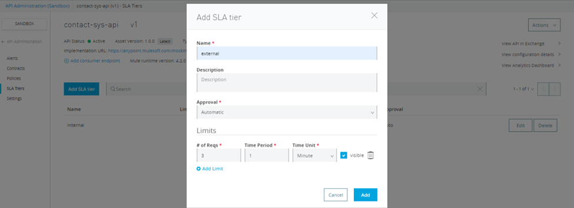

- Now you can see two SLA Tiers get created now go to Policies

 
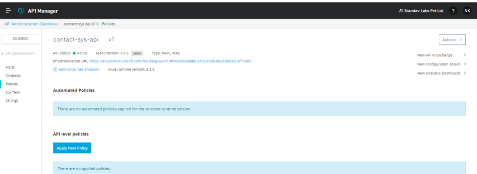

- Click on **Add New Policy**  &rarr; Rate Limiting(SLA Based)

 
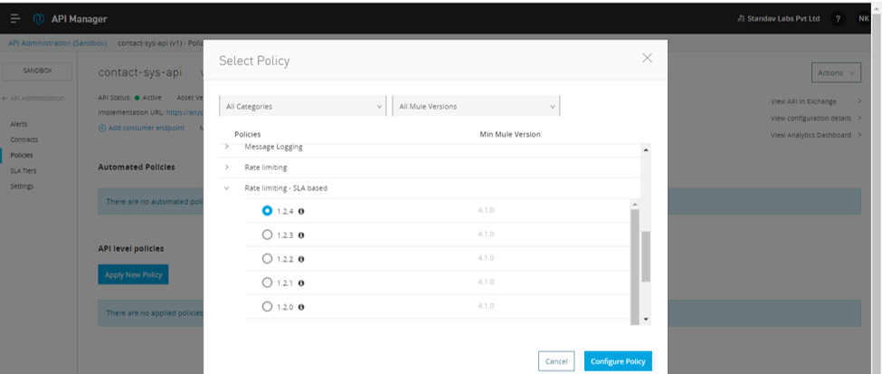

- Select the method &amp; Resource conditions as per requirement and click on Apply.

 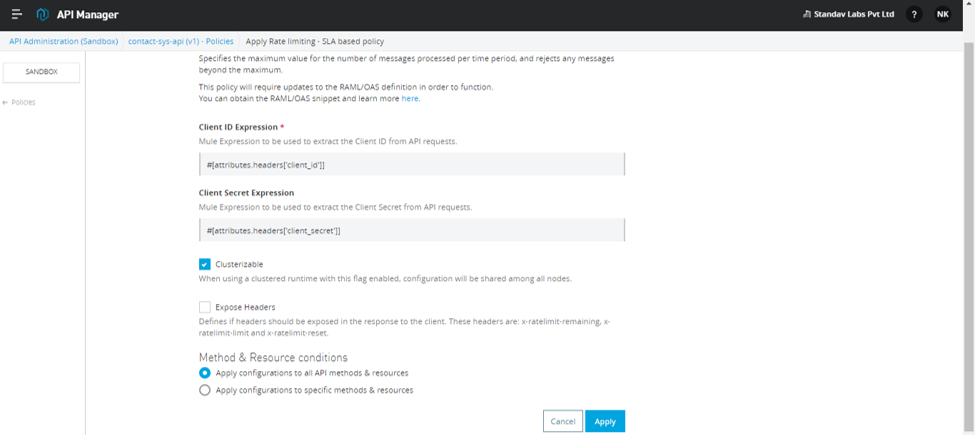

- Here you can select the policies for each API for different Methods.

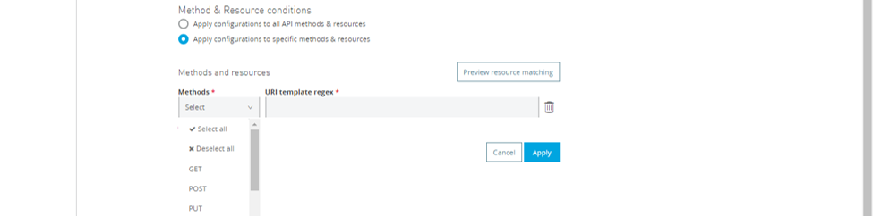

- Go to Exchange and click on API Request Access.

 
 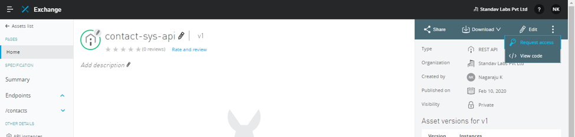

- Select the API INSTCANCE  and click on create new application.

 
 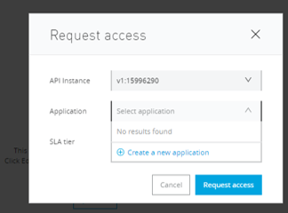

- Name the application as per the SLA Tier names and click on create

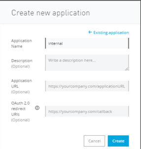

- Select the API application and select the SLA Tier, now click on Request access.

 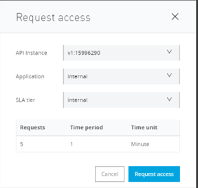

- Repeat the same for the External user so the API access with client id and client secret is created.

- You can see the Internal and external users created with client id and client secret.

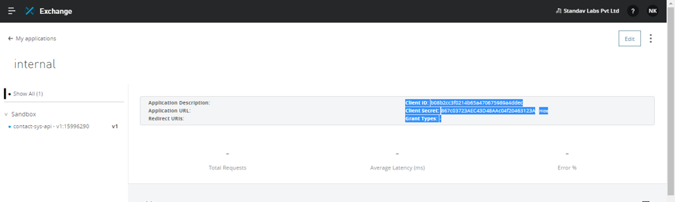

- Go to Exchange click on **my applications** you can fin the internal and external applications

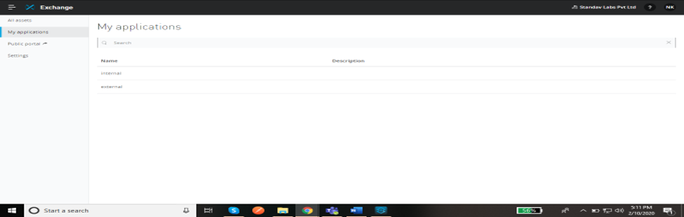

- Test the API with client id and client secret of  as per the Rate limit for each user
- You can see the **429 error as too many requests**
- In this API for Internal User has the access for 5 request per minute if exceeded it throws

**ERROR 429**

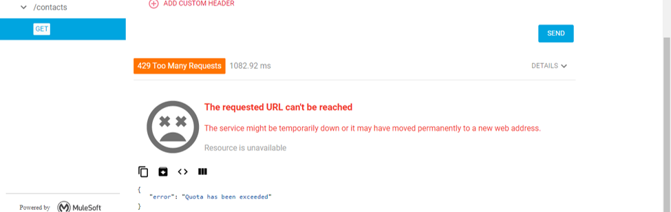

 